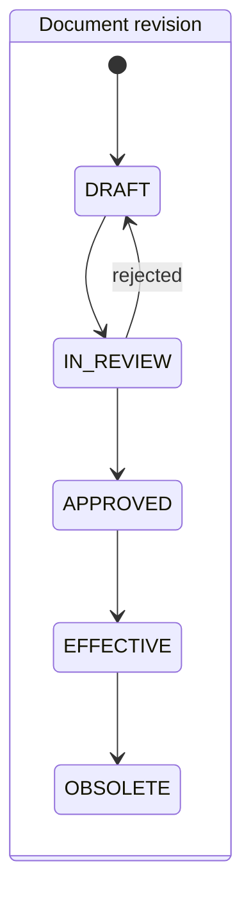
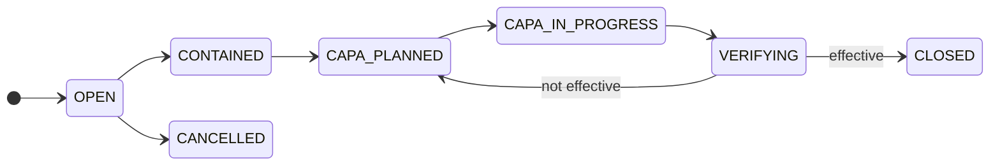
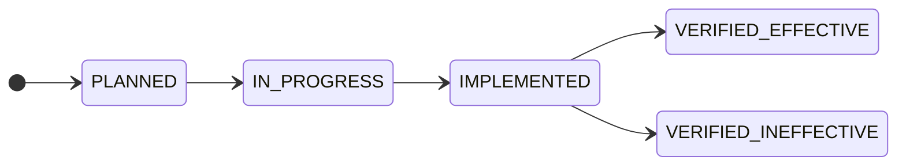

# ISO 9001 Gap Analysis of the QMS Application

This report assesses whether the application provides the documented information and process support that an organization needs to demonstrate each ISO 9001 requirement in a certification audit. It is the input for the domain work that must precede the MCP server for AI agents.

- **Baseline:** `main@b794952` (2026-10-02).
- **Method:** read-only review of models, forms, routes, templates, reports and scheduled tasks. File and line references point to that commit.
- **Framing:** software cannot comply with ISO 9001; the organization does. Each clause is judged on whether the app can hold the evidence and support the process.

## Summary

**No clause is fully covered.** The application is a set of independent CRUD registers: records are not linked, versioned, approved, or attributed to a person.

| Status | Clauses |
|---|---|
| Covered | 0 |
| Partial | 21 |
| Not covered | 9 (6.3, 7.1.5, 7.1.6, 7.4, 7.5.3, 8.3, 8.5, 8.6, 9.3) |
| Documentary support only | 4 (4.1, 4.3, 5.1, 7.3) |

Findings an auditor would raise with near certainty:

1. **7.5.3 Control of documented information:** editing a document overwrites it and deleting is permanent. There is no revision history, status, approval, or file attachment.
2. **9.3 Management review:** mandatory, and absent.
3. **10.2 Corrective action:** no root cause, owner, due date, or effectiveness verification.
4. **9.2 Internal audit:** no audit programme or classified findings, and findings are not linked to nonconformities.
5. **6.2 Quality objectives:** a single text field, with no target or tracking.
6. **Traceability:** people are free text and no record stores who changed what, or when.

**Implication for the MCP work:** the main effort is turning the registers into a quality management system, with about 15 new entities. The MCP server is the smaller part. Because both the web UI and the MCP server will call one shared service layer, MCP tools can ship module by module as each module is remodeled.

## Reference standard

**ISO 9001:2026 was published on 2026-09-16** and replaces ISO 9001:2015 with Amendment 1:2024. The AENOR store lists UNE-EN ISO 9001:2026. Certified organizations have a three-year transition, to about September 2029.

> **Note:** publication and transition data come from secondary sources (AFNOR, AENOR store, sector publications). `[VERIFY: confirm against iso.org and the UNE text before relying on exact clause wording.]`

The study used the 2015 + Amd 1:2024 clause structure. The 2026 edition keeps clauses 4 to 10, so the assessment remains valid. These 2026 changes affect the application and must be designed in from the start:

| Topic | Change | Impact on the app |
|---|---|---|
| Risks and opportunities (6.1) | Treated as separate concepts, with more weight on opportunities | Split `RiesgoOportunidad` into distinct risk and opportunity records |
| Change management (6.3) | More planning, communication, monitoring and effectiveness review of QMS changes | `ChangeRecord` becomes a priority, not an optional extra |
| Leadership (5.1) | Promote quality culture and ethical behaviour | Documentary support: evidence records and acknowledgements |
| Climate change (4.1, 4.2) | Amendment 1:2024 folded into the main text | Climate relevance flag on context issues and stakeholder requirements |
| Management review (9.3) | Inputs include changes in stakeholder needs | Review input linked to the stakeholder register |
| Documented information (7.5) | Wording moves from "maintain" to "available as documented information" | No model change expected |

## Verified defects

These were confirmed by reading the code at the baseline. The first two were already reported by the September 2026 bug audit and remain open.

| Defect | Location | Effect |
|---|---|---|
| Monthly report counts all-time totals | `app/utils/reports.py`, `_monthly_report_context` | The `fecha` argument only labels the report; counts and the satisfaction average are never filtered by month |
| Satisfaction chart mixes years | `app/routes/dashboard_routes.py`, `extract('month', ...)` | January 2025 and January 2026 are averaged together |
| Any authenticated user can delete a nonconformity | `app/routes/no_conformidad_routes.py`, `eliminar_no_conformidad` | Hard delete guarded only by `@login_required`; no role check and no trace |

## Clause-by-clause assessment

Legend: **C** covered, **P** partial, **N** not covered, **D** documentary support only.

| Clause | Status | Evidence | Gap |
|---|---|---|---|
| 4.1 Context | D | None | No register of internal and external issues or climate relevance |
| 4.2 Interested parties | P | `ParteInteresada` models.py:55-61; parte_interesada_routes.py:24-62 | No requirement list, owner, review date, relevance flag or climate flag |
| 4.3 Scope | D | None | Scope, applicability and justified exclusions are not recorded |
| 4.4 Processes | P | `ProcesoOperacion` models.py:89-95; JSON API only | No inputs, outputs, owner, interactions, KPIs or process risks; no HTML UI |
| 5.1 Leadership | D | `RolResponsabilidad.compromiso_calidad` models.py:68 | Evidence of commitment cannot be attached |
| 5.2 Quality policy | P | `descripcion_politica_calidad` models.py:69 | Not a controlled, versioned and communicated document; no acknowledgement record |
| 5.3 Roles | P | `RolResponsabilidad` models.py:64-69; JSON API only | Roles are not linked to users, processes or the application's access roles |
| 6.1 Risks and opportunities | P | `RiesgoOportunidad` models.py:72-78; JSON API only | No scoring, owner, due date or status; no link to actions, context or processes |
| 6.2 Quality objectives | P | `RiesgoOportunidad.objetivo_calidad` models.py:77 | No objective entity with target, owner, deadline or periodic measurement |
| 6.3 Planning of changes | N | None | No change register |
| 7.1 Resources | P | `RecursoCapacitacion` models.py:81-86; JSON API only | Text list without type, owner or status |
| 7.1.5 Monitoring and measuring resources | N | None | No equipment register or calibration records |
| 7.1.6 Organizational knowledge | N | None | No knowledge register or lessons learned |
| 7.2 Competence | P | `Capacitacion` models.py:260-267; capacitacion_routes.py:25-106 | No competence matrix; person is free text; no effectiveness evaluation or certificates |
| 7.3 Awareness | D | None | No acknowledgement of policy or objectives |
| 7.4 Communication | N | None | No communication plan |
| 7.5.1 Documented information | P | `Document` models.py:304-314 | See 7.5.2 and 7.5.3 |
| 7.5.2 Creating and updating | P | Identification fields models.py:307-311; document_routes.py:27-85 | No author, reviewer or approval workflow; `signature` unused; text only, no uploads |
| 7.5.3 Control | N | Edit in place document_routes.py:55-75; hard delete 77-85 | No revisions, status, distribution, retention or obsolete marking |
| 8.1 Operational planning | P | `ProcesoOperacion.criterio_calidad` models.py:93 | No operational plan or acceptance criteria per process |
| 8.2 Requirements for products and services | P | `SatisfaccionCliente` models.py:251-257 | No customer requirement review, change record, communication log or complaints |
| 8.3 Design and development | N | None | No design entity; may be excluded only if the organization justifies it |
| 8.4 External providers | P | `ProcesoOperacion.control_proveedor` models.py:94 | Boolean only; no supplier, approval or evaluation |
| 8.5 Production and service provision | N | None | No control, traceability, customer property or post-delivery records |
| 8.6 Release | N | None | No release record |
| 8.7 Nonconforming outputs | P | `NoConformidad` models.py:240-248 | No type, disposition, concession, lot or link to product or process |
| 9.1.1 Monitoring and measurement | P | reports.py:27-49; dashboard_routes.py:28-81 | All-time totals only; indicators are not entities |
| 9.1.2 Customer satisfaction | P | `SatisfaccionCliente` models.py:251-257; satisfaccion_cliente_routes.py:25-109 | Customer is free text; no survey type, channel or target |
| 9.1.3 Analysis and evaluation | P | dashboard_routes.py:28-81 | Counts and averages only; no trends or objective-versus-actual |
| 9.2 Internal audit | P | `Auditoria` models.py:277-285; auditoria_routes.py:27-160; audit_notifications.py:51-105 | No programme, criteria, scope, team or classified findings; corrective action is free text |
| 9.3 Management review | N | Document category `INFORME_REVISION` models.py:298 | No review entity, inputs, outputs, decisions or follow-up |
| 10.1 Improvement | P | `Mejora` models.py:108-114 | Free-text list, no pipeline |
| 10.2 Nonconformity and corrective action | P | `NoConformidad` models.py:240-248; states in forms.py:73 | No root cause, action entity or effectiveness check; `estado` and `fecha_cierre` are independent |
| 10.3 Continual improvement | P | `Mejora` models.py:108-114; dashboard trend | `fecha_implementacion` defaults to creation time; no link to objectives or management review |

## Top 10 gaps by audit impact

| # | Gap | Clause | Why an auditor flags it | Domain change |
|---|---|---|---|---|
| 1 | Uncontrolled documents | 7.5.3 | Cannot show which version was in force on a given date | `DocumentRevision`, document status machine, approval workflow, file storage |
| 2 | No management review | 9.3 | Mandatory clause with nothing to audit | `ManagementReview`, `ReviewInput`, `ReviewOutput` |
| 3 | Open corrective-action loop | 10.2 | No root cause, owner, deadline or effectiveness evidence | `CorrectiveAction`, NC-to-action link, NC state machine |
| 4 | No audit programme | 9.2 | No planned programme, criteria, independence or classified findings | `AuditProgramme`, `AuditFinding`, finding-to-NC link |
| 5 | Unmeasurable objectives | 6.2 | Nothing measured against a target over time | `QualityObjective`, `ObjectiveMeasurement` |
| 6 | No attribution or history | Cross-cutting | Records cannot be trusted without who and when | `AuditLog`, `created_by`, `updated_at` on every record |
| 7 | People as free text, no competence matrix | 5.3, 7.2, 7.3 | Same person under several spellings; competence not provable per role | `Person` linked to `User`, `CompetenceRequirement` |
| 8 | No supplier control | 8.4 | Only a boolean | `Supplier`, `SupplierEvaluation`, approved-supplier status |
| 9 | No calibration register | 7.1.5 | Required wherever measurement results are used | `MeasuringEquipment`, `CalibrationRecord` |
| 10 | Risks, opportunities and context unlinked | 4.1, 4.2, 6.1 | No scoring, actions or review; 2026 treats risks and opportunities separately | Separate risk and opportunity records with scoring, `ContextIssue`, link to actions |

## Cross-cutting gaps

- **No foreign keys or relationships.** Every link between records is manual text (models.py:55-317).
- **No record chains.** None of these links exist: nonconformity → root cause → corrective action → effectiveness; audit finding → nonconformity; risk → action; complaint → nonconformity.
- **No complaint handling.** Only satisfaction surveys exist.
- **Coarse access control.** Three roles. Most registers require only login. Document control is administrator-only, so no separate approver role exists.
- **Reports are not period-bound.** Management review inputs cannot be produced for a period.

## Target domain model

This is a proposal for the SDD phases to refine, not a final design. Field names are indicative.

### Existing entities to change

| Entity | Changes |
|---|---|
| `User` | Link to `Person`; `active`, `last_login` |
| `Document` | `status`, `owner_id`, `next_review_date`, `retention_until`; content and files move to `DocumentRevision`; `approved_by` becomes a foreign key |
| `NoConformidad` | `source` (audit, customer, process, supplier, other), `process_id`, `severity`, `containment`, `disposition`, `responsible_id`, `root_cause`, `created_by`, `closed_by`; `estado` becomes an enum with transitions |
| `Auditoria` | `programme_id`, `scope`, `criteria`, `lead_auditor_id`, audit team, report; keeps its state enum (models.py:270-274) |
| `Mejora` | Becomes an improvement opportunity linked to its source |
| `Capacitacion` | Link to `Person` and `CompetenceRequirement`; effectiveness result |
| `SatisfaccionCliente` | Link to `Customer`; `survey_type`, `channel` |
| `RiesgoOportunidad` | Split into risk and opportunity; `probability`, `severity`, `level`, `owner_id`, `status`, `review_date`, links to context, process and action |
| `ProcesoOperacion` | `owner_id`, inputs, outputs, indicators |
| `AuditoriaIndicador` | Merge into `Auditoria` or turn into an indicator entity |

### New entities

| Entity | Purpose | Clause |
|---|---|---|
| `AuditLog` | Entity, action, user, channel (web or MCP), timestamp, before and after | Cross-cutting |
| `Person`, `Customer`, `Supplier` | Replace free-text names | 5.3, 7.2, 8.4, 9.1.2 |
| `DocumentRevision` | Versioned content or file, approval data | 7.5.3 |
| `CorrectiveAction` | Owner, due date, status, effectiveness result | 10.2 |
| `QualityObjective`, `ObjectiveMeasurement` | Target, unit, owner, deadline, periodic values | 6.2 |
| `AuditProgramme`, `AuditFinding` | Yearly programme; findings classified as major NC, minor NC, observation or opportunity | 9.2 |
| `ManagementReview`, `ReviewInput`, `ReviewOutput` | Period-bound inputs, decisions and follow-up actions | 9.3 |
| `Complaint` | Customer complaint with optional link to a nonconformity | 9.1.2, 10.2 |
| `SupplierEvaluation` | Periodic score and result | 8.4 |
| `MeasuringEquipment`, `CalibrationRecord` | Equipment status and next due date | 7.1.5 |
| `ContextIssue`, `InterestedPartyRequirement` | Context and stakeholder requirements with climate flag | 4.1, 4.2 |
| `Action` | Generic action for risks, objectives and review outputs | 6.1, 9.3 |
| `ChangeRecord` | Planned QMS changes with impact and owner | 6.3 |
| `CompetenceRequirement`, `CommunicationPlan` | Competence per role; what, when, to whom and how | 7.2, 7.4 |

### Key state machines

A revision moves from draft through review and approval to effective, and becomes obsolete when superseded. A rejected review returns it to draft. Content is immutable once effective.

A nonconformity is contained, gets a corrective action plan, and closes only after effectiveness is verified, with a close date and an actor. An ineffective action returns it to planning.

A corrective action is planned, executed, implemented and then verified. An ineffective verification triggers a new action.

## Strengths to preserve

- Security work: strict CSP, single-use reset tokens proven under PostgreSQL concurrency, password-bound tokens (models.py:137-234), CLI-only administrator bootstrap (commands.py:47-102), and the security logger.
- `role_required` with administrator override (decorators.py:21-38).
- Themed PDF exports for nonconformities, audits, training and surveys, which are ready-made audit evidence.
- Celery scheduling with per-recipient failure isolation (audit_notifications.py:140-173) and timezone handling.
- The legacy-state tolerance for nonconformities (no_conformidad_routes.py:46-52, 79-85), a sound pattern for migrating `estado` to an enum.
- Marshmallow schemas (schemas.py) as a base for the MCP tool contracts.

## Proposed roadmap

Each wave adds MCP tools for the modules it completes, on top of the shared service layer.

| Wave | Scope | MCP outcome |
|---|---|---|
| 0. Foundations | Service layer, `AuditLog` and record metadata, `Person`, permission policy, API tokens, fix the three verified defects | Token authentication and read-only tools for existing registers |
| 1. Audit-critical | Document control, nonconformity → corrective action → effectiveness, audit programme and findings, quality objectives, then management review (it consumes the others) | Read and write tools for these modules, no delete tools |
| 2. Core QMS | Suppliers, customers and complaints, competence matrix, separate risks and opportunities, context, change management | Tools per module as delivered |
| 3. Organization-dependent | Calibration, design and development, production and release, communication, organizational knowledge | Only for modules the organization does not exclude |

## Limits of this study

- Clause requirements are paraphrased; the standard is not quoted.
- Line references were collected by a read-only review at `b794952`. The three defects above were re-verified by reading the code; other references may shift as the code changes.
- Whether 7.1.5, 8.3, 8.5 and 8.6 apply depends on the organization's activity and justified exclusions.
